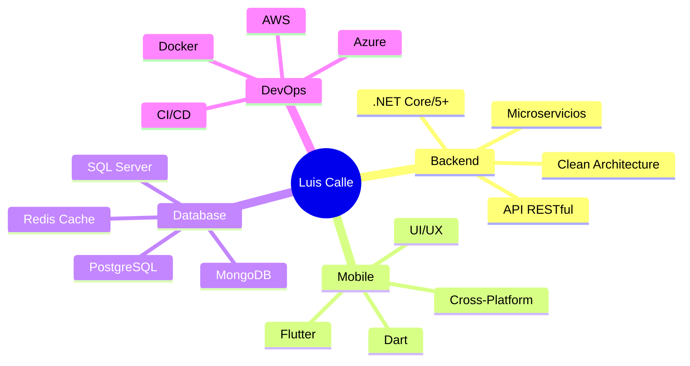

<div align="center">
  
# 👨‍💻 Deynar

### Backend Developer .NET | Mobile Developer Flutter

<p align="center">
  
</p>

[](https://linkedin.com/in/tu-perfil)
[](https://github.com/LuisCalleLazo)
[](mailto:tu-email@ejemplo.com)

</div>

---

## 🚀 Sobre Mí

```csharp
public class DeveloperProfile
{
    public string Name { get; set; } = "Luis Calle Lazo";
    public string Role { get; set; } = "Backend Developer .NET | Mobile Developer";
    public string Location { get; set; } = "Bolivia 🇧🇴";
    
    public List<string> Specialties => new List<string>
    {
        "Arquitecturas Escalables y Seguras",
        "Optimización de Bases de Datos",
        "APIs RESTful & Microservicios",
        "Desarrollo Móvil Multiplataforma",
        "Cloud Computing & DevOps"
    };
    
    public string CurrentFocus { get; set; } = 
        "Construyendo sistemas de alto rendimiento y aplicaciones móviles intuitivas";
}
```

---

## 💼 Stack Tecnológico

<table>
<tr>
<td valign="top" width="50%">

### 🎯 Backend Development
<div align="center">
  


</div>
</td>

<td valign="top" width="50%">

### 📱 Frontend & Mobile
<div align="center">
  


</div>
</td>
</tr>

<tr>
<td valign="top" width="50%">

### 🗄️ Databases
<div align="center">
  


</div>
</td>

<td valign="top" width="50%">

### ☁️ DevOps & Cloud
<div align="center">
  


</div>
</td>
</tr>

<tr>
<td colspan="2" valign="top">

### 🛠️ Tools & Others
<div align="center">
  


</div>
</td>
</tr>
</table>

---

## 📊 GitHub Analytics

<div align="center">
  
  
</div>

<div align="center">
  
</div>

<div align="center">
  
</div>

---

## 🏆 GitHub Trophies

<div align="center">
  
</div>

---

## 💡 Áreas de Expertise



---

## 📈 Contribution Graph

<div align="center">
  
</div>

---

## 🎯 Proyectos Destacados

<div align="center">

[](https://github.com/LuisCalleLazo/nombre-proyecto-1)
[](https://github.com/LuisCalleLazo/nombre-proyecto-2)

</div>

---

## 📫 Conecta Conmigo

<div align="center">

¿Tienes un proyecto interesante? ¿Quieres colaborar? ¡Hablemos!

[](https://linkedin.com/in/tu-perfil)
[](https://twitter.com/tu-usuario)
[](mailto:tu-email@ejemplo.com)
[](https://tu-portfolio.com)

</div>

---

<div align="center">
  
### 💭 Quote of the Day


### 👁️ Profile Views


---

⭐️ From [LuisCalleLazo](https://github.com/LuisCalleLazo) | Made with ❤️ and ☕

</div>
